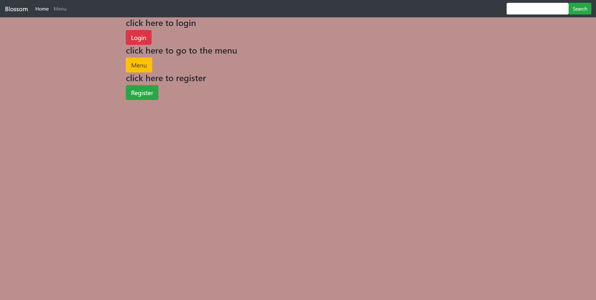
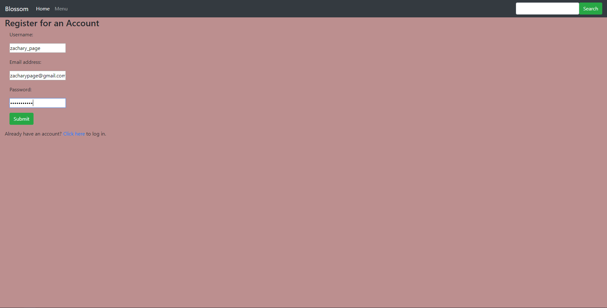
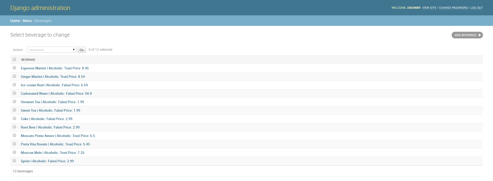

# Blossom

## Table of Contents

- [Features](#features)
- [Examples](#examples)
- [Support](#support)

## Features

- Database integration using SQlite3
- Front-End Integration using HTML, Javascript, and CSS
- Back-end created using Django & Python

## Examples

- **Logo for Website**

- **Landing Page**

- **Register Interface**

- **Administration Database**

## Support

Reach out to me at one of the following places!

- LinkedIn at <a href="https://www.linkedin.com/in/pagezacharyc/" target="_blank">Zachary Page</a>
- Email at <a href='mailto:pagezacharyc@gmail.com' target="_blank">pagezacharyc@gmail</a>

---
